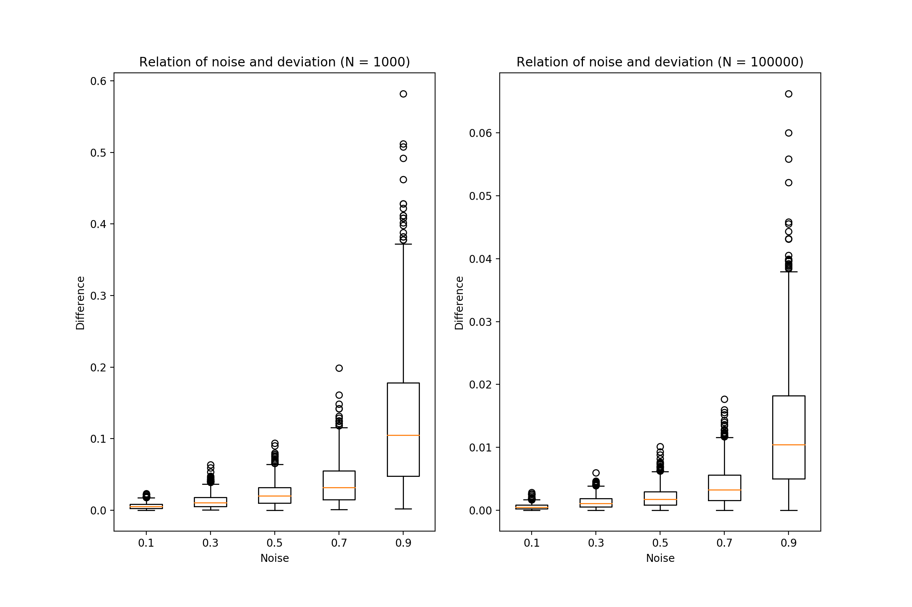

# Introducing Local and Global Differential Privacy

The main goal of Differential Privacy is to get the **most accurate query results** with the **greatest amount of 
privacy** (minimize amount of noise adding and maximize amount of privacy)





## Definitions
### 1. Local Differential Privacy
Add noise to function data points (function inputs)
- Add noise for each individual data before inserting to database
- Users don't have to trust database owner

### 2. Global Differential Privacy
Add noise to function outputs (to the queries)
- The database contains all the private information
- Noise is added only to the **interface to the data**
- Require **Trustworthy** database owners

### 3. Trusted Curator
An owner of a database upon which Global Differential privacy is applied. They are trusted to apply DP correctly

### 4. Randomized Response
Technique that is used in social sciences when trying to learn about the **high level trends** for a **taboo** behavior
(see examples)
The results of a survey (e.g on jaywalking) can be skewed because some subset of population is going to 
**answer dishonestly** -> Introduce randomized response (plausible deniability to response) to average the honest 
answers: 
- For each person, **flip a coin 2 times**:
    - If the first coin flip is head -> Answer honestly
    - If the first coin is tail -> Answer according to the **second coin flip** (head -> positive, tail -> negative)

- The noisy survey result can be used to average the actual positive percent of the population.
  

## Examples
Denote: 
- P(head1): Probability that the first coin flip is head
- P(head2) = P(tail2) = 0.5
- P(positive): Actual positive percentage of population
- P(survey positive): Percentage positive in the result of the survey

1. If 70% of the population is actual positive. With 2 flips strategy of **balance** coin, find the average % positive 
of the survey
    - Given:
        - P(positive) = 0.7
        - P(head1) = P(tail1) = 0.5
    ```
    P(survey positive) = P(head1 and positive)  + P(tail1 and head2) 
                       = P(head1) * P(positive) + P(tail1) * P(head2)                       (1)
                       =   0.5    *     0.7     +    0.5   *   0.5 
                       =   0.6
    ```
                      
2. With 2 flips strategy and a **balance** coin, the result of a survey is 60% positive. Average the actual positive of 
this population:

    - Given:
        - P(survey positive) = 0.6
        - P(head1) = P(tail1) = 0.5
        
    ```
    (1): P(survey positive) = P(head1) * P(positive) + P(tail1) * P(head2) 
     =>     P(positive)     = (P(survey positive)    - P(tail1) * P(head2)) / P(head1)      (2) 
     =>     P(positive)     = (       0.6            -   0.5    *   0.5   ) /   0.5 
                            = 0.35 / 0.5 
                            = 0.7
    ```
    
3. Same question with example 2, if the coin is **imbalance** (70% head : 30% tail)
    - Given:
        - P(survey positive) = 0.6
        - P(head1) = 0.7
        - P(tail1) = 0.3
        
    ```
    (2): P(positive) = (P(survey positive) - P(tail1) * P(head2)) / P(head1)
                     = (        0.6        -    0.3   *    0.5  ) /   0.7
                     =   0.643
    ```
## Notes
1. ```torch.rand``` return random numbers from a uniform distribution on the interval [0, 1)
2. Differential Privacy always requires a form of randomness or noise added to the query to protect from things like 
Differencing Attacks
3. DP can **gain privacy with the cost of accuracy** if the population size is small
